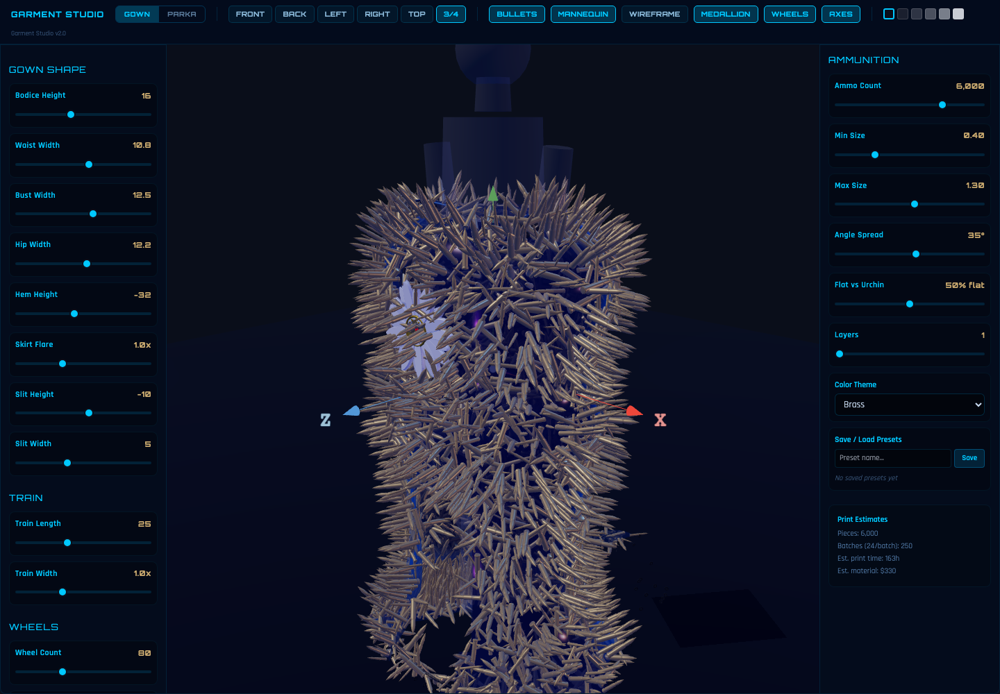

# Bullet Gown Studio

Interactive 3D fashion configurator for a high-concept metallic gown built with React and Three.js.

Live demo: https://owenheidenreich.github.io/sea-urchin-parka/



## Reviewer Summary

- **What it is:** a browser-based design studio for inspecting and customizing a 3D couture gown with bullet-inspired surface detailing.
- **Tech stack:** React, Vite, TypeScript, Three.js, Zustand, Tailwind CSS.
- **Hosting:** GitHub Pages from the repository's `main` branch.
- **Status:** public demo is live; the repository also contains related garment-design experiments in branch history.

## What It Demonstrates

- Real-time 3D rendering with camera controls, lighting, materials, and responsive layout.
- Configurable garment silhouette and surface treatment controls.
- Frontend state management for interactive design tooling.
- Static deployment workflow suitable for GitHub Pages.

## Local Development

```bash
npm install
npm run dev
```

Open the Vite local URL shown in the terminal, typically `http://localhost:5173/`.

## Build

```bash
npm run build
npm run preview
```

The production build is emitted to `dist/`.

## Reviewer Notes

This project is intended as a visual/frontend engineering demo. The live review path is the GitHub Pages deployment above; local setup is only needed if you want to inspect or modify the implementation.
